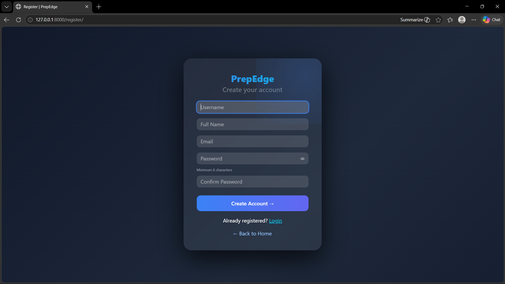
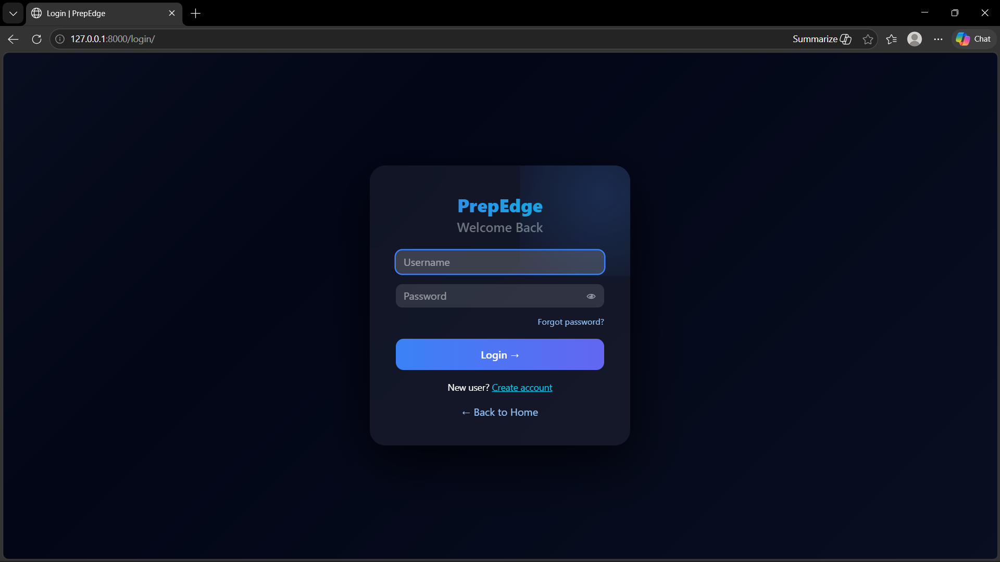
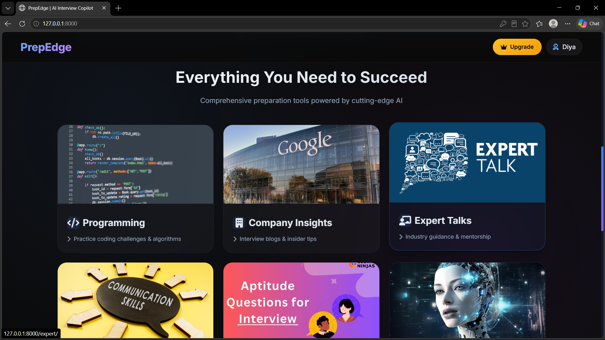
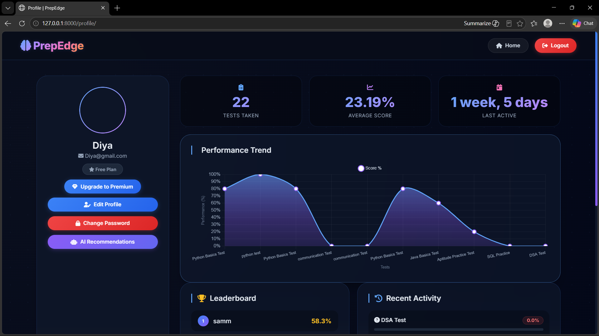
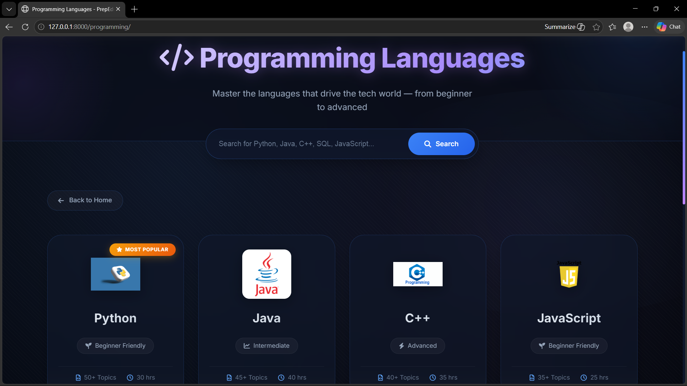
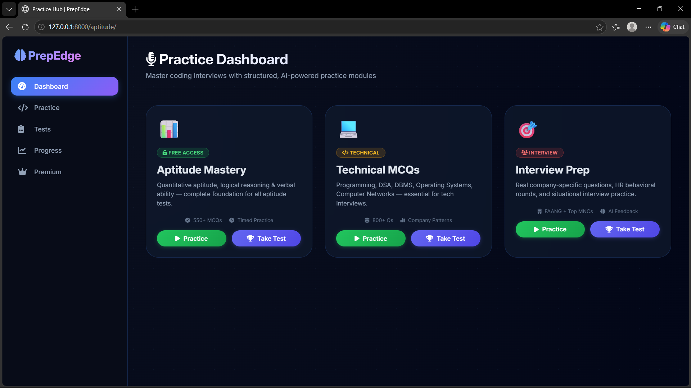
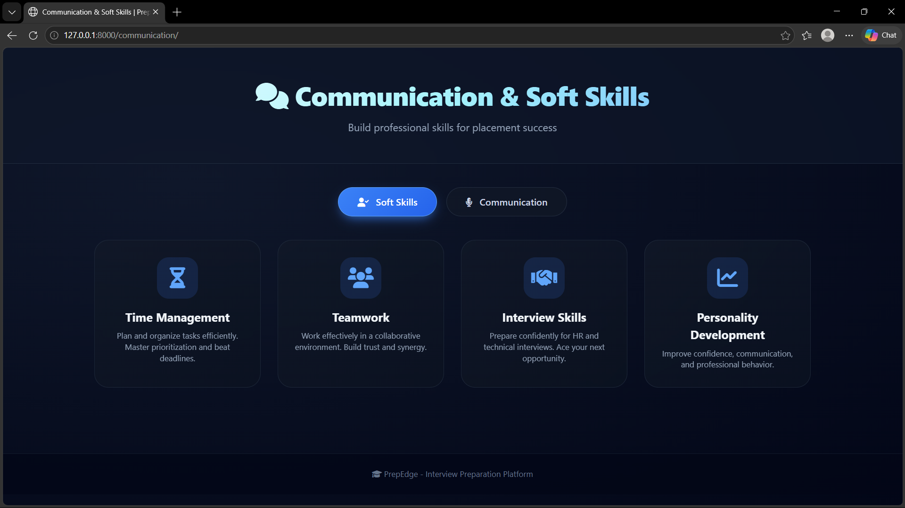
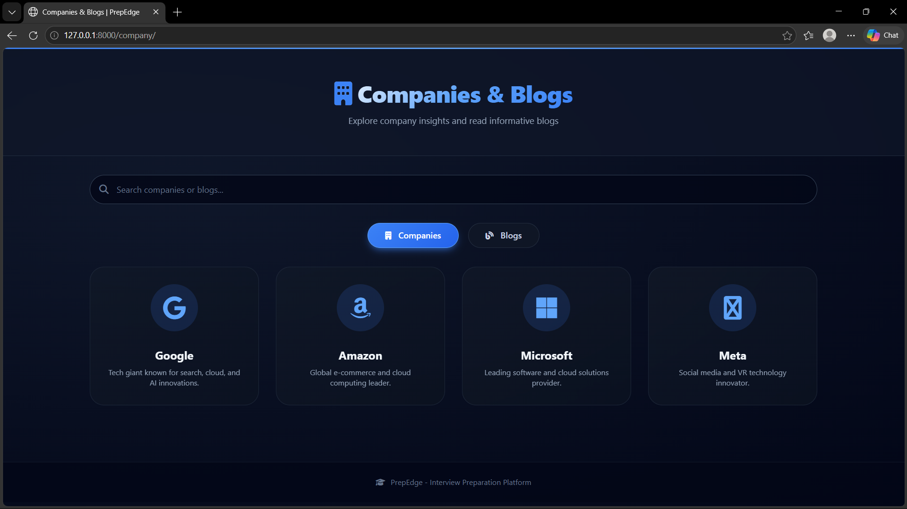
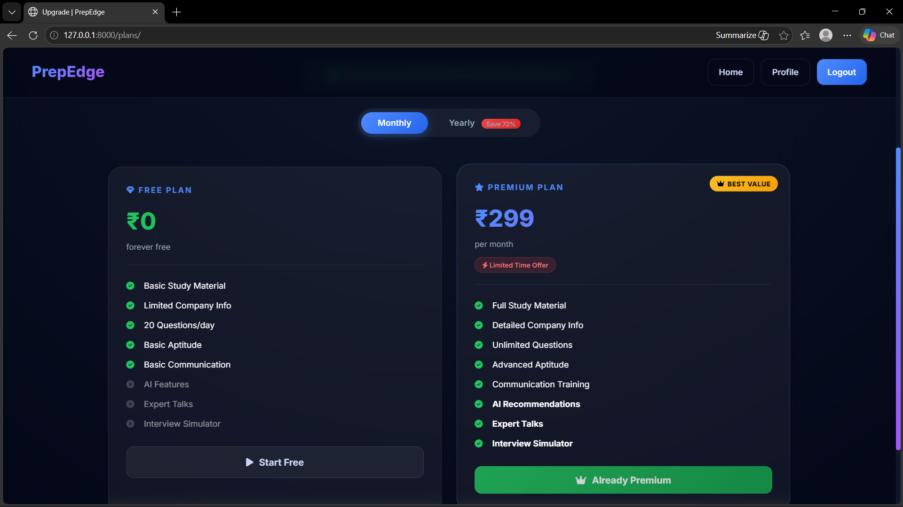
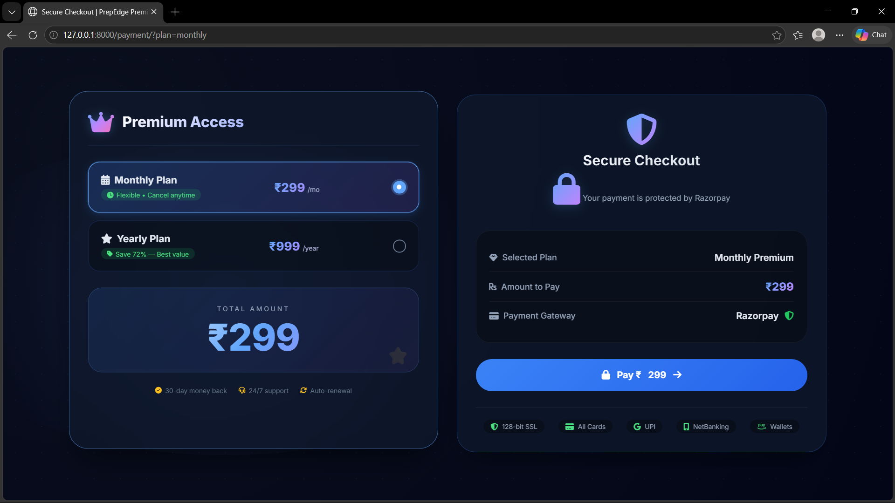

# 🚀 PrepEdge — AI-Powered Interview Preparation Platform

> **Prepare smarter. Practice better. Get placement ready.**

PrepEdge is a subscription-based interview preparation platform built with **Python & Django**. It brings coding practice, aptitude training, communication skills, AI-powered coaching, and personalized performance analytics together in one place — so students and job seekers don't have to juggle multiple sites.

---

## 📌 Table of Contents

- [About](#-about)
- [Key Features](#-key-features)
- [AI Features](#-ai-features)
- [Subscription System](#-subscription-system)
- [Admin Panel](#-admin-panel)
- [Technology Stack](#-technology-stack)
- [Project Structure](#-project-structure)
- [Installation](#-installation)
- [Usage](#-usage)
- [Future Enhancements](#-future-enhancements)
- [Developer](#-developer)

---

## 📖 About

PrepEdge is designed to be a one-stop platform for placement preparation. Instead of switching between multiple websites for aptitude, coding, HR prep, and career guidance, users get everything from a single dashboard — along with AI-driven recommendations that adapt to their performance.

---

## ✨ Key Features

### 👨‍🎓 User Features

- Registration, Login & Secure Authentication
- Profile Management
- Personalized Dashboard
- Subscription Plans with Premium Content Access
- Learning Progress Tracking
- Performance Analytics

---

### 📚 Learning Modules

| Module | Topics Covered |
|--------|----------------|
| 💻 Programming | Python, Java, C++, SQL, Web Development, Interview Questions |
| 🧮 Aptitude | Quantitative, Logical Reasoning, Verbal Ability, Mock Tests |
| 🎤 Communication | HR Interview Prep, Resume Tips, Soft Skills, Group Discussion |
| 🏢 Company Prep | Company-wise interview preparation for top recruiters |
| 🎥 Expert Talks | Career Guidance, Placement Tips, Interview Experiences |

---

## 🤖 AI Features

### AI Interview Coach

- Answers interview-related queries
- Explains technical concepts
- Provides preparation tips and guidance

### AI Personalized Recommendations

The recommendation engine analyzes:

- Programming scores
- Aptitude performance
- Communication progress

…and recommends:

- Weak topics to focus on
- Curated learning resources
- Targeted practice questions
- Actionable improvement suggestions

### Performance Analysis

- Track completed modules
- View detailed progress reports
- Identify strengths and areas for improvement

---

## 💳 Subscription System

Premium content is protected behind subscription plans using:

- **Razorpay** Payment Gateway Integration
- Subscription validation & access control
- Tiered premium learning content

---

## 👨‍💼 Admin Panel

Administrators can manage the entire platform from a single dashboard:

- User Management
- Learning Content (Programming, Aptitude, Communication, Company Prep)
- Expert Talks Management
- Subscription Plans
- Analytics Dashboard

---

## 🛠 Technology Stack

| Layer | Technologies |
|-------|--------------|
| Frontend | HTML5, CSS3, JavaScript, Bootstrap |
| Backend | Python, Django |
| Database | SQLite |
| AI | Gemini API, OpenAI API |
| Payment | Razorpay |
| Authentication | Django Authentication |
| Version Control | Git & GitHub |

---

## 📷 Screenshots

### Authentication

| Register | Login |
|----------|-------|
|  |  |

### Dashboard

| Home | Profile |
|------|---------|
|  |  |

### Learning Modules

| Programming | Aptitude |
|-------------|----------|
|  |  |

| Communication | Company Preparation |
|---------------|---------------------|
|  |  |

### Subscription

| Plans | Payment |
|-------|---------|
|  |  |

### AI Features

| AI Interview Coach | Recommendations |
|--------------------|----------------|
| [Coach](screenshots/coach.png) | [Recommendations](screenshots/recommendations.png) |

---

## 📂 Project Structure

```
prepedge-django-interview-platform/
│
├── ai_coach/               # AI Interview Coach app
├── ai_recommendations/     # Personalized recommendation engine
├── app1/                   # Core application
├── prepedge/               # Project settings & URLs
├── templates/              # HTML templates
├── static/                 # Static files (CSS, JS, images)
├── media/                  # User-uploaded media
├── screenshots/            # Application screenshots
├── manage.py
├── requirements.txt
└── README.md
```

---

## ⚙️ Installation

### 1. Clone the Repository

```bash
git clone https://github.com/yourusername/prepedge.git
cd prepedge
```

### 2. Create & Activate a Virtual Environment

**Windows:**
```bash
python -m venv venv
venv\Scripts\activate
```

**Linux / macOS:**
```bash
python -m venv venv
source venv/bin/activate
```

### 3. Install Dependencies

```bash
pip install -r requirements.txt
```

### 4. Apply Migrations

```bash
python manage.py migrate
```

### 5. Create a Superuser *(Optional)*

```bash
python manage.py createsuperuser
```

### 6. Run the Development Server

```bash
python manage.py runserver
```

Open in browser:

- **App:** `http://127.0.0.1:8000/`
- **Admin Panel:** `http://127.0.0.1:8000/admin/`

---

## 🎯 Usage

**As a User:**
1. Register and log in
2. Choose a subscription plan
3. Access learning modules (Programming, Aptitude, Communication)
4. Practice questions and solve mock tests
5. Get AI-powered recommendations based on your performance
6. Track your progress from the dashboard

**As an Admin:**
1. Log in at `/admin/`
2. Manage users, content, subscriptions, and expert talks
3. Monitor platform analytics

---

## 🔮 Future Enhancements

- 📱 Android & iOS Mobile App
- ☁️ Cloud Deployment (AWS / GCP / Heroku)
- 🧠 AI Resume Analyzer
- 🎥 Live Mock Interviews
- 💻 Online Coding Compiler (in-browser)
- 🎙️ Voice-Based AI Interview Simulation
- 📊 Advanced Analytics Dashboard
- 🏢 Company-wise Placement Roadmaps
- 🏆 Gamification & Achievements
- 📄 Resume Builder

---

## 💡 Project Highlights

- ✅ AI-Powered Interview Coach (Gemini / OpenAI)
- ✅ Personalized Learning Recommendations
- ✅ Subscription-Based Premium Content
- ✅ Performance Analytics & Progress Tracking
- ✅ Responsive Bootstrap UI
- ✅ Secure Django Authentication
- ✅ Razorpay Payment Integration
- ✅ Modular Django App Architecture

---

## 👩‍💻 Developer

**Samiksha Apake**
*MCA Student | Python & Django Developer*

**Skills:** Python · Django · Django REST Framework · FastAPI · SQL · Bootstrap · Git · GitHub

---

## ⭐ Support

If you found this project helpful, consider giving it a ⭐ on GitHub — it helps others discover it and motivates further improvements!

---

*Made with ❤️ using Python & Django*